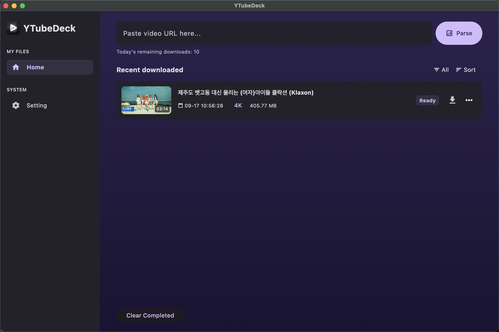
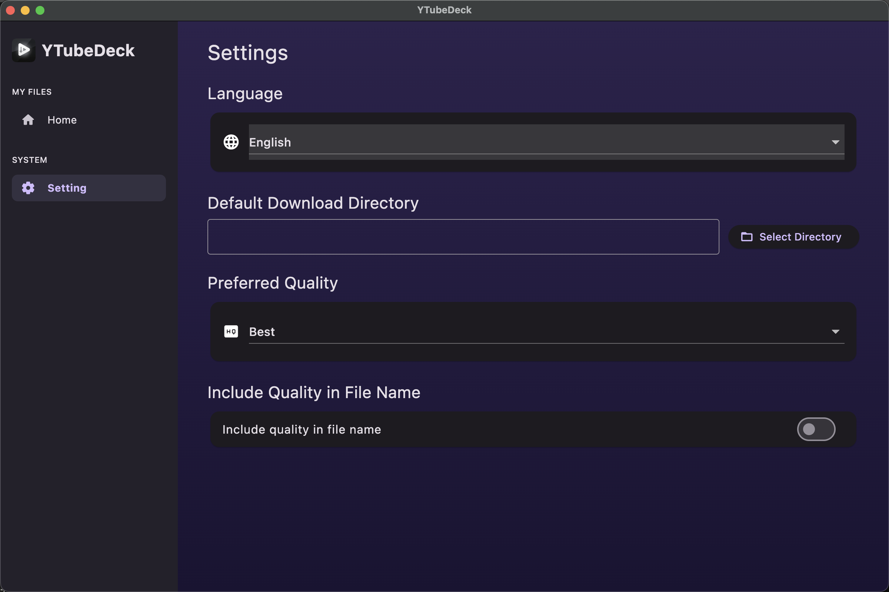

  <a href="README.md">English</a> •
  <a href="README.zh-CN.md">简体中文</a>

---
# YTubeDeck
 YTubeDeck is a desktop application for macOS designed for batch downloading of YouTube videos.

⭐ Please star this repository to stay up-to-date with the latest releases!

## Download
*   [Download the latest version for macOS (YTubeDeck.dmg)](./YTubeDeck.dmg)

## Screenshots
| Home | Setting |
|:---:|:---:|
|  |  |